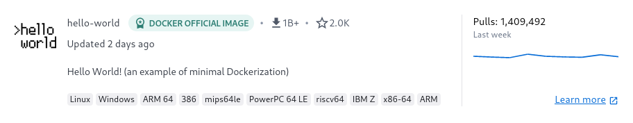

# Docker - WIP Document!

## What is Docker

Docker is one of several Containerization platforms. It can be used to deploy and run applications inside containers.

A container is a lightweight, standalone, and executable package of 
software that includes everything needed to run an application, such as 
code, runtime, system tools, libraries, and settings.

Other containerization platforms include Podman and LXC.

One of the points of containers is that they are very easy to deploy, and to tear down again. This also makes updating the container a breeze, since it is as easy as pulling down the image, and then tearing the container down, and then put it back up again.

Docker runs as a Daemon on the server, which we can communicate with with either docker CLI, or one of the docker desktop implementations.

## Installing Docker

Instructions on how to install Docker can be found in the excellent docker documentation.

Debian: [Install Docker Engine on Debian | Docker Documentation](https://docs.docker.com/engine/install/debian/)

Ubuntu: [Install Docker Engine on Ubuntu | Docker Documentation](https://docs.docker.com/engine/install/ubuntu/)

CentOS: [Install Docker Engine on CentOS | Docker Documentation](https://docs.docker.com/engine/install/centos/)

Other Redhat Based: See CentOS instructions

## Docker user

Running docker commands can either be done as root, or as user whom has been added to the docker group

we can add a user to the docker group with the usermod command.

```bash
root@dockerlxc ~# usermod -aG docker dockeruser
```

## Test that docker is installed and working.

The easiest way to test that docker is working, is to pull down and run the official docker container called "hello-world". 


To run this container we use the "docker run" command. This checks, if we already have the image downloaded. If we do not, it will download it from dockerhub (it is possible to host our own registry server aswell, and pull from there. Dockerhub is configured as default).

```bash
[ramiraz@thor ~]$ docker run hello-world
Unable to find image 'hello-world:latest' locally
latest: Pulling from library/hello-world
2db29710123e: Pull complete 
Digest: sha256:6e8b6f026e0b9c419ea0fd02d3905dd0952ad1feea67543f525c73a0a790fefb
Status: Downloaded newer image for hello-world:latest
```

Once the image is downloaded docker will run it. 

This specific container is configured to output a message to the console, and then exit again.

```bash
Hello from Docker!
This message shows that your installation appears to be working correctly.

To generate this message, Docker took the following steps:
 1. The Docker client contacted the Docker daemon.
 2. The Docker daemon pulled the "hello-world" image from the Docker Hub.
    (amd64)
 3. The Docker daemon created a new container from that image which runs the
    executable that produces the output you are currently reading.
 4. The Docker daemon streamed that output to the Docker client, which sent it
    to your terminal.

To try something more ambitious, you can run an Ubuntu container with:
 $ docker run -it ubuntu bash

Share images, automate workflows, and more with a free Docker ID:
 https://hub.docker.com/

For more examples and ideas, visit:
 https://docs.docker.com/get-started/
```

## Listing containers on the server

To see what containers are running on the server, we can use the "docker ps" command

```bash
[ramiraz@thor ~]$ docker ps
CONTAINER ID   IMAGE     COMMAND   CREATED   STATUS    PORTS     NAMES
```

This shows us, that we do not have any specific containers running at the moment.

If we use the add a "-a" flag to the command, we get to see all containers on the server, even if they are stopped.

```bash
CONTAINER ID   IMAGE         COMMAND    CREATED         STATUS                     PORTS     NAMES
2d979a1a7cde   hello-world   "/hello"   2 minutes ago   Exited (0) 2 minutes ago             admiring_dirac
```

This shows us our hello-world container, we ran before, it also shows us its unique (on this system) ID, when it was created, when it was exited, and what name it was given. If we do not specify a name when we run the container, it will be given a random name.

Documentation: [docker ps | Docker Documentation](https://docs.docker.com/engine/reference/commandline/ps/)


## Docker CLI (Docker Commands)

docker CLI is the commandline way of working with docker. it has alot of commands we  can use. 

See full listing here: [Use the Docker command line | Docker Documentation](https://docs.docker.com/engine/reference/commandline/cli/)

I will attempt to document a few of the most used commands below here.

### Command: Docker run

The docker run command has a wide range of options available, we can use to further define how we want our container to run. The once most often used, are listed here:

1. `-d`: Runs the container in the background (detached mode).
2. `--name`: Assigns a name to the container.
3. `-p`: Maps a port on the host to a port in the container.
4. `-v`: Maps a directory on the host to a directory in the container (for persistent data storage).
5. `-e`: Sets an environment variable in the container.
6. `-it`: Starts an interactive session with the container (this is a combination of the `-i` and `-t` options).
7. `--rm`: Removes the container when it exits.
8. `--network`: Attaches the container to a specific Docker network.
9. `--entrypoint`: Overrides the default entrypoint of the container image.
10. `--restart`: Defines the restart policy of the container.
11. `--user`: Sets the user account to run the container as.
12. `--volume-driver`: Specifies the driver used for a volume.
13. `--health-cmd`: Sets a command to run to check the health of the container.

A full listing can be found in the official documentation, here: [docker run | Docker Documentation](https://docs.docker.com/engine/reference/commandline/run/)

### Command: Docker pull

The docker pull command is used to pull down a container image from a remote registry. By default this is docker hub, but we can also selfhost a docker registry, and pull from there.

Documentation: [docker pull | Docker Documentation](https://docs.docker.com/engine/reference/commandline/pull/)


### Command: Docker start

The docker start command is used to start a previously stopped docker container. (the ones we can see with "docker ps -a", but which are not running).

It can be used with either the container name or container id (or just enough of either to identify the container)

Documentation: [docker start | Docker Documentation](https://docs.docker.com/engine/reference/commandline/start/)


### Command: Docker stop

The docker stop command is used to stop a running container.

Documentation: [docker stop | Docker Documentation](https://docs.docker.com/engine/reference/commandline/stop/)


### Command: Docker stats

The command docker stats, can be used to show statistics for running docker containers, here amongst CPU and Memory usage

```bash
[ramiraz@thor ~]$ docker ps
CONTAINER ID   IMAGE     COMMAND       CREATED          STATUS          PORTS     NAMES
fee615ef7925   ubuntu    "/bin/bash"   38 seconds ago   Up 37 seconds             unruffled_shirley

CONTAINER ID   NAME                CPU %     MEM USAGE / LIMIT   MEM %     NET I/O       BLOCK I/O   PIDS
fee615ef7925   unruffled_shirley   0.00%     540KiB / 15.54GiB   0.00%     10.6kB / 0B   0B / 0B     1
```

Documentation: [docker stats | Docker Documentation](https://docs.docker.com/engine/reference/commandline/stats/)


### Command: Docker top

the command docker top can be used to see the top running processes inside the container (similar to running "top" on our own linux system).

```bash
[ramiraz@thor ~]$ docker top fee
UID                 PID                 PPID                C                   STIME               TTY                 TIME                CMD
root                10325               10290               0                   12:42               ?                   00:00:00            /bin/bash
```

Documentation: [docker top | Docker Documentation](https://docs.docker.com/engine/reference/commandline/top/)


### Command: Docker attach

The command docker attach, is used to attach to a running container, so we can use our terminal inside the container.

To attach to a container, we need either the Container ID, or the Container name.

```bash
[ramiraz@thor ~]$ docker ps
CONTAINER ID   IMAGE     COMMAND       CREATED         STATUS         PORTS     NAMES
af01b6476382   ubuntu    "/bin/bash"   4 seconds ago   Up 3 seconds             condescending_pasteur
[ramiraz@thor ~]$ docker attach af01


[ramiraz@thor ~]$ docker attach af01
root@af01b6476382:/# 

[ramiraz@thor ~]$ docker attach condescending_pasteur
root@af01b6476382:/# 

```

To exit the container again we can use the key sequence: **CTRL+p and then CTRL+Q**.
This sends us out of the container again, and keeps it running. 
This is **IMPORTANT**, because if we just type exit, it will shut down the container.


### Command: Docker cp

The command docker cp can be used to copy files from the host system to the inside of a container (and the other way around)

```bash
[ramiraz@thor ~]$ docker cp file1 condescending_pasteur:/root/
Successfully copied 1.536kB to condescending_pasteur:/root/

[ramiraz@thor ~]$ docker attach condescending_pasteur
root@af01b6476382:/# ls /root
file1
```

Documentation: [docker cp | Docker Documentation](https://docs.docker.com/engine/reference/commandline/cp/)


