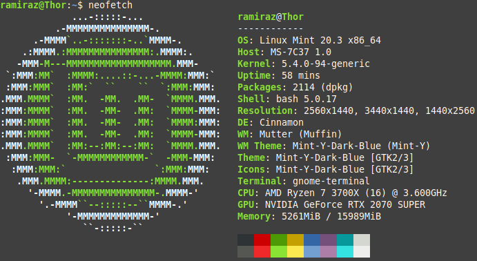

# Nifty Software I use

## Htop

Link: [GitHub - htop-dev/htop: htop - an interactive process viewer](https://github.com/htop-dev/htop)

Htop is an alternative to the “top” command, which have some
extra features, and if you ask me, just looks nicer.  
There are
many alternatives to “top”, but this is the one I prefer to use

## TLDR

Link: [GitHub - tldr-pages/tldr: 📚 Collaborative cheatsheets for console commands](https://github.com/tldr-pages/tldr)

tldr is an alternative or rather, a supplement to the “–help”
argument or man pages. It gives a few usefull examples on how to use
a command. I use this, alongside the “–help” argument, because
it provides me with real examples of how to use a command. It does
not have examples for all commands yet, but more and more are coming.

## VIM

Link: [GitHub - vim/vim: The official Vim repository](https://github.com/vim/vim)

Which editor to use is almost a religious question amongst the linux
community. There are alot of good editors, and many of these have
alot of different forks. This is fantastic, because you are pretty
much sure to find an editor that suits you, depending on your
usecase.

For my editing needs I prefer to use vim. I am by no means an
expert in it, but it serves me well enough.

## Neofetch

link: [GitHub - dylanaraps/neofetch: 🖼️ A command-line system information tool written in bash 3.2+](https://github.com/dylanaraps/neofetch)

Neofetch is a fun and usefull little tool, that I am sure you have seen in
screenshots, if you have ever visited a linux subreddit. Its purpose
is to print out information about your computer, Operating System and
Desktop Enviroment in the terminal.

## Syncthing

Link: [GitHub - syncthing/syncthing: Open Source Continuous File Synchronization](https://github.com/syncthing/syncthing)

Syncthing is a file synchronization tool, that is used to keep files and
folders in sync across multiple computers.  
It has many different
use cases, but for myself, I just use it to keep my documents,
wallpapers, and .ssh/config file in sync between my desktop and my
laptop.

It runs as a service in the background on the computer and can be
accessed through a web gui.

TMUX

Link: [GitHub - tmux/tmux: tmux source code](https://github.com/tmux/tmux)

tmux is a “Terminal Multiplexer” which is quite a mouth full to say.
It is a terminal program, that allows me to have several terminals
open inside one terminal emulator, instead of running the terminal
emulator several times. It is hotkey operated. It is very powerfull
and if run on a remote system, can be used to keep your session
alive, even after I have disconnected. I can then connect back to the
remote system and resume my terminal session.

tmux has ALOT of hotkeys to remember. So many that a good cheat sheet is
needed. Luckily they exist on the internet. Here is a link to a good
one: [https://tmuxcheatsheet.com/](https://tmuxcheatsheet.com/)

