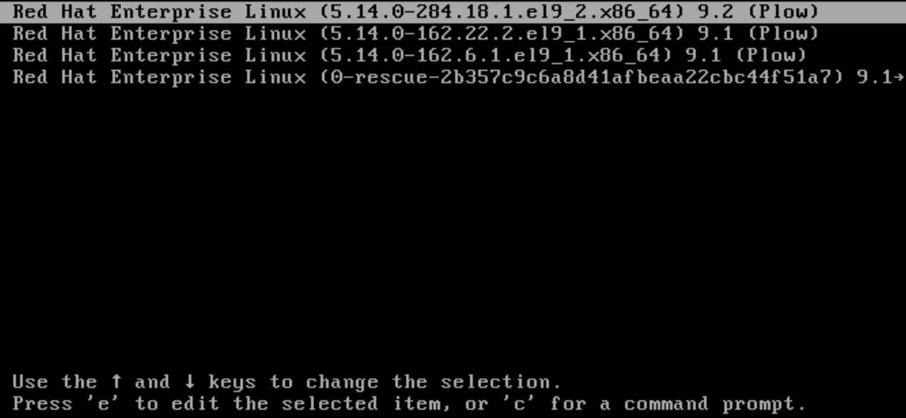
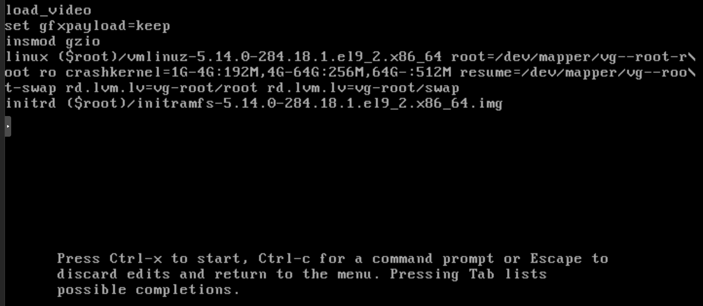
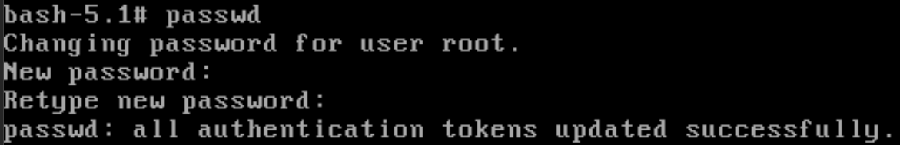
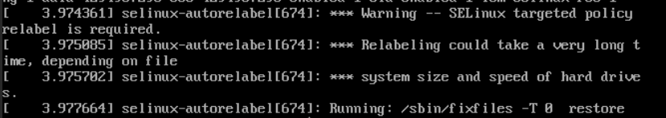

# Root password recovery on a Linux server

If we need recover a lost root password on a Linux server, we can do it by booting the server in to emergency mode.

To boot a server to emergency mode we need console access to the server (if it is a VM), or either physical access or ILO access if it is a physical server.

For the first step, we need access to the grub menu. On most distributions, we can force the grub menu to appear by holding in the SHIFT key while the server is booting. If it is a virtual server, it might boot too fast to use the shift key to show the grub menu. In this case we should invesigate if the servers Hypervisor has an option to delay boot.



Once the grub menu appears we navigate to the kernel we wish to boot (This will typicaly be the top one, as this is the latest one), and press " e " to edit.

Once the edit menu appears, navigate to the line starting with "linux" (the third line in this case), and press CTRL+e to get to the end of the line. 



At the end of this line, there are a few things we can add, depending on what we want to achieve.

- init=/bin/bash - boot in to emergency mode, with root partition mounted as read only.

- systemd.unit=emergency.target - boot in to halted boot, root password needed, with root partition mounted as read only (usefull for fixing other errors).

- systemd.unit=rescue.target - boot in to halted boot, root password needed, with root partition mounted as read only (usefull for fixing other errors). Loads more services than emergency.target.

- rd.break - similar to init=/bin/bash - will boot in to singleuser emergency mode, with the root partition mounted to /sysroot in read only mode.

Boot by pressing CTRL+x.

### if rd.break was used

since rd.break mounts the root partition to /sysroot instead of / this requires an extra step.

First we need to remount the root partition to be read / write. This is the same for all four options. it is just the mountpoint that differs.

we remount with the following command

```bash
mount -o remount,rw /sysroot
```

once this is done, we need to change root to /sysroot. we use the chroot command for this. this will open a subshell with /sysroot as /.

```bash
chroot /sysroot
```

### The other 3 options

First we need to remount the root partition to be read / write. This is the same for all four options. it is just the mountpoint that differs.

we remount with the following command

```bash
mount -o remount,rw /
```

We can now proceed to change the root password, with the passwd command



if rd.break was used, remember to exit the subshell.

We now need to tell the system to relabel all SELINUX labels on next boot.

To do this we just need to create a file called .autorelabel in / with touch.

```bash
touch /.autorelabel
```

Once the file is made, we can reboot the server (if the server throws a kernel panic, reboot it either with CTRL+ALT+DELETE, the reset button, or reset it in the hypervisor).


Once the server is rebooting, it will take a bit longer than usual, for the autorelabeling to take effect.




We can now log in to the server with our new root password.