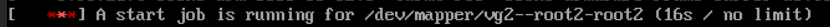
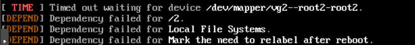
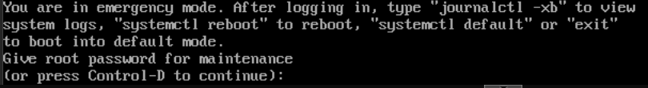
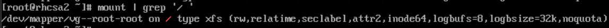
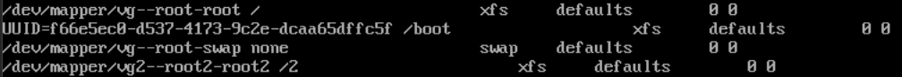
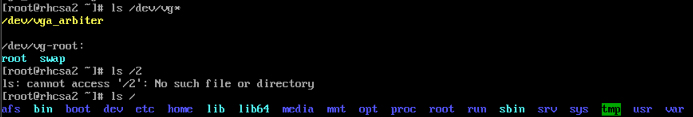

# Enter recovery mode when the server wont boot

Sometimes when a server wont boot, we can enter a recovery mode. This requires physical access (or ILO access), or if its a vm, console access is required.

For our example here, I have purposefully created an error in the fstab file, that will cause the server to not boot.

First the server will halt and try to mount the faulty mountpoint. It will eventually fail

The error is shown here. It was unable to mount the "/2" folder. it now falls to us to find out why.

This will cause the boot to be unable to complete, and the server will hang with the following message:

If we press CTRL+D here it will try to continue the boot, which will fail becaouse of the above error.

Instead we can give the server the root password, and we will get in to the recovery prompt (which is like single user mode), as root.

The first thing we do, is make sure the filesystem is mounted as read / write.

To check this, type "mount | grep '/ ' "

This will show how " / " is mounted. if it says rw (meaning read / write), we can proceed. If it says ro (meaning read only), we will need to remount the filesystem as read/write. 

Since I know from the above error message, that it is a problem with filesystem mount points, my first place to investigate, is the /etc/fstab file.

If we use cat to look at the fstab file, we can see that "/dev/mapper/vg2--root2-root2" points to /2.

First I will check if either (or both) the /2 folder or the LVM volume exists.

As shown here, neither exist. 

If neither is supposed to exist, we can fix this error by commenting out the offending line in the /etc/fstab file.

We can now reboot the server and it should reboot as normal (given that there are no other errors)

If we are not sure, we would need to consult the documentation for this server, or other administrators of this server, to figure out if they should exist (and might have been deleted by accident).

Once we are certain they are not supposed to exist, we can delete the commented out line from the fstab file.

