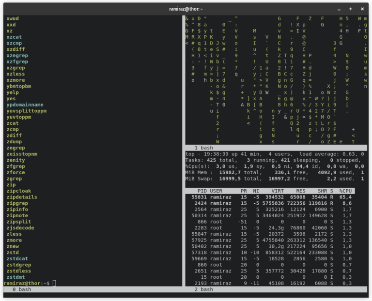
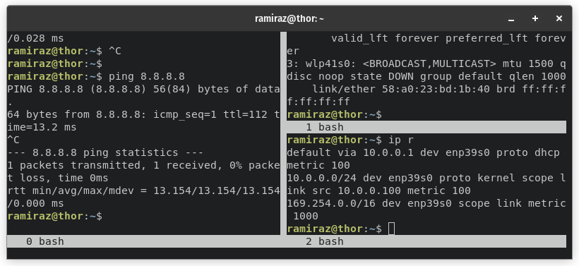

# Terminal Multiplexing

When I open a Terminal session I am usually limited to doing one thing at a time, per terminal session, and if I close the terminal, what I was doing usually goes away. If I open a new terminal session, I start from scratch again.  
But the solution to this problem is terminal multiplexing. This allows me to have multiple “panes or windows” inside of one terminal window.

It also gives me the ability to detach from a session, and reattach later. This is particularly helpful when working on a remote server, since I can detach my multiplexing session, and then reattach to it, the next time I connect to the server.

there are several programs that can be used to have access to multiplexing.

One way is to install a terminal with built in multiplexing, like Terminator. This can usualy be found in my distributions software repository. The downside of this, is that it locks me in to the terminator program. I prefer to use another terminal application, and therefore I need another way to do this.

There are some different CLI applications I can use to add multiplexing to my chosen terminal. The two I will mention here are “Screen” and “Tmux”. they share alot of functionality, though “Tmux” seems to be the more advanced of the two, with automatic window renaming among other things.

### Screen

NOTE: All commands need to be prefixed with the action key. By default, this is Ctrl+a  
Ctrl+a c new window  
Ctrl+a n next window  
Ctrl+a p previous window  
Ctrl+a ” select window from list  
Ctrl+a Ctrl+a previous window viewed

Ctrl+a S split terminal horizontally into regions Ctrl+a c to create new window there  
Ctrl+a | split terminal vertically into regions Requires screen >= 4.1  
Ctrl+a :resize resize region  
Ctrl+a :fit fit screen size to new terminal size Ctrl+a F is the same. Do after resizing xterm  
Ctrl+a :remove remove region Ctrl+a X is the same  
Ctrl+a tab Move to next region

Ctrl+a d detach screen from terminal Start screen with -r option to reattach  
Ctrl+a A set window title  
Ctrl+a x lock session Enter user password to unlock  
Ctrl+a [ enter scrollback/copy mode Enter to start and end copy region. Ctrl+a ] to leave this mode  
Ctrl+a ] paste buffer Supports pasting between windows  
Ctrl+a > write paste buffer to file useful for copying between screens  
Ctrl+a < read paste buffer from file useful for pasting between screens

Ctrl+a ? show key bindings/command names Note unbound commands only in man page  
Ctrl+a : goto screen command prompt up shows last command entered

### Tmux

NOTE: All commands need to be prefixed with the action key. By default, this is Ctrl+b

Ctrl+b c – create new window  
Ctrl+b n/p – move to next/previous window  
Ctrl+b 0-9 – move to window number 0-9  
Ctrl+b l – move to previously selected window  
Ctrl+b f – find window by name  
Ctrl+b w – menu with all windows  
Ctrl+b & – kill current window  
Ctrl+b , – rename window

Ctrl+b % – split window, adding a vertical pane to the right  
Ctrl+b ” – split window, adding an horizontal pane below  
Ctrl+b q – show pane numbers (used to switch between panes)  
Ctrl+b o – switch to the next pane  
Ctrl+b left/right – move focus to left/right pane  
Ctrl+b up/down – move focus to upper/lower pane  
Ctrl+b ! – Break current pane into new window  
Ctrl+b x – Kill the current pane.

Ctrl+b d – detach the current client  
Ctrl+b ? – list all keybindings  
Ctrl+b ? – show tmux key bindings  
Ctrl+b [ – enter copy mode (then use emacs select/yank keys)

press CTRL-SPACE or CTRL-@ to start selecting text  
move cursor to end of desired text  
press ALT-w to copy selected text  
] – paste copied text
